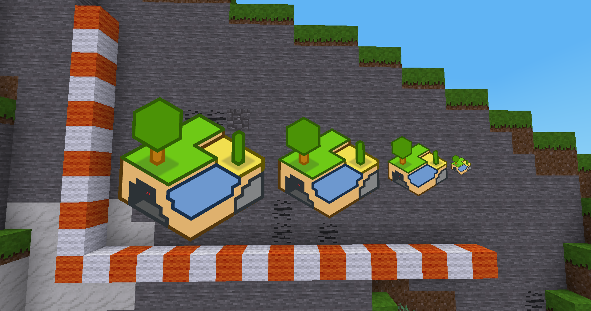

# Minetest-Merch
## Infinite paintings for Minetest :dog:



This mod generates a bunch of usable paintings into the game.
Paintings are generated by a bash script using ImageMagick. (linux only)
The generated painting's sizes are 1024x1024.
If your image is a rectangle, it's longer side will be cropped to 1024 pixels and the remaining space will be filled with transparency.

Dump all your desired Minetest-paintings into the textures folder and run the script. (.png, .jpg, .jpeg)
* give the script the permission to be executed
> ```user@host:~/mods/merch$ chmod u+x generate.sh```
* to execute the script execute the following:
> ```user@host:~/mods/merch$ ./generate.sh```

### How to play with this mod?
First, craft a canvas of your desired size
* small = 1 block
* normal = 3 blocks
* large = 5 blocks
* extra large = 7 blocks

Then go to the "Paintings" menu in the unified_inventory.
Put your canvas into the input slot and click on your desired painting.
It will draw one painting per click

### Depends on:
* [unified_inventory](https://github.com/minetest-mods/unified_inventory)
### My feature wishlist
* Images can be printed on [clothing](https://github.com/stujones11/clothing) shirts
